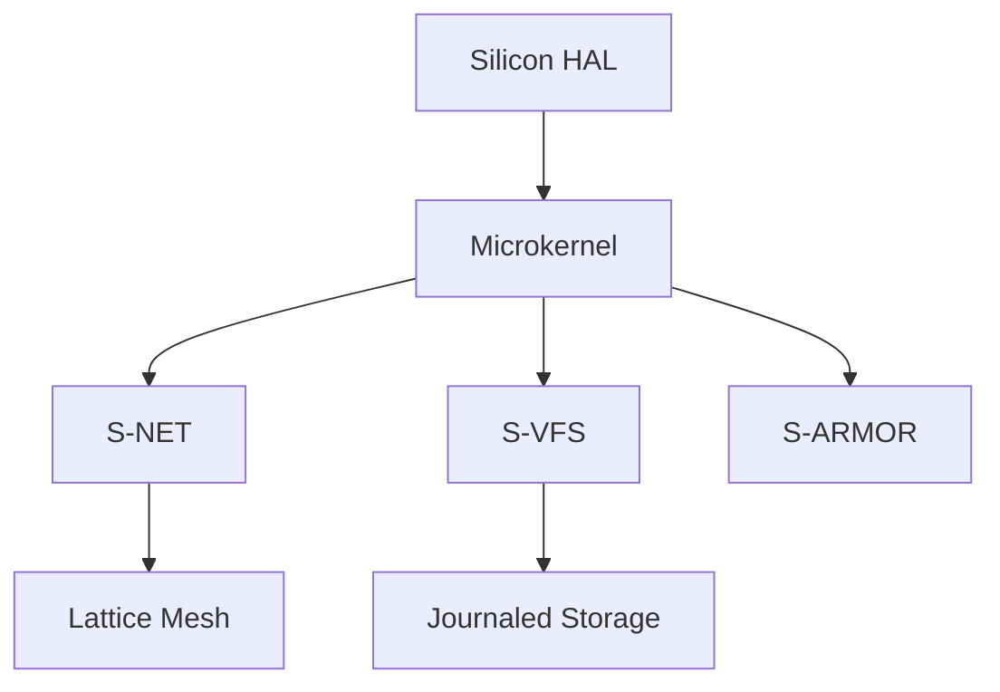
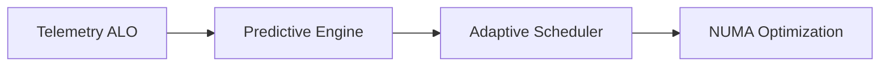

# SigmaOS Subsystem Architecture (Generated)

## 1. Sovereign Lattice Core



## 2. AI-Adaptive Pipeline



## 3. Package Distribution

```mermaid
graph TD
    A[Global Repository] --> B[Sovereign Mirror]
    B --> C[sigma-pkg]
    C --> D[PQC Signature Verifier]
    D --> E[Shard Sandbox]

```text
